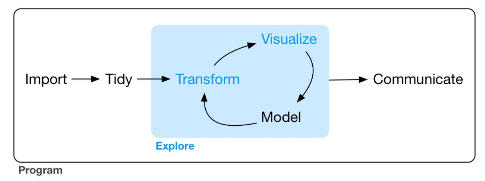

# 前言

```{r,eval = FALSE}
install.packages("tidyverse")
```

安装tidyverse，tidyverse是一个包集，里面包含许多个进行数据处理的包如：ggplot2、dplyr、tibble等。由于这个包集中的包更新较频繁，所以可以使用更新命令`tidy verse_update()`对集合中的包进行更新。

```{r,eval = FALSE}
install.packages(c("nycflights13", "gapminder", "Lahman"))
```

以上三个包包含了r4ds这本书中需要用到的数据集。

在学习这本书的过程中或者是将书中所学运用到实际的过程中或碰到很多书中没有解答的问题，这时需要我们自己去从互联网上寻找答案。这时我们可以去Google搜索、去stackoverflow提问，在向别人求助时，最好的方式是使用reprex package创建一个reprex（a minimal reproducible example）方便与别人交流。

```{r,eval=FALSE}
reprex::reprex_render()
```

将你的问题代码复制到剪贴板中，然后运行上面的代码就可以在剪贴板中得到一个可以复制到其他地方的reprex。

# 第一章 Tibbles with tibble



从上图中可以看到，数据分析有其相对固定的流程，首先是数据的导入（import）、数据的整理（tidy）然后进入到数据explore流程，explore流程包括数据的转换（transform）、数据的可视化（visualize）以及数据建模，最后就是将分析的结果呈现出来进行交流探讨的过程。书本中内容讲述的顺序是首先讲解数据的explore，然后才是数据大import、tidy等过程，但是我在阅读这本书的时候调整了阅读顺序，按照上图中所展示的顺序进行阅读，笔记整理，所以首先学的是tidyverse中自定义的数据类型tibble。

tibble是一种不同于但是类似于base R中dataframe的数据结构，这种数据结构是又tidyverse中的tibble包所提供。

## 创建tibbles

在tidyverse中，tibble是一个内在的属性，所以这个包集中的几乎所有函数的输入输出结果都是tibble的形式。但是对于tidyverse以外很多包中的函数，都是基于base r的data.frame的形式，对于这种差别可以使用`as_tibble()`函数进行转换。

除此之外，也可以像构建data.frame一样手动的建立一个tibble，第一种方式是使用`tibble()`函数。
```{r}
library("tidyverse")
tibble( x = 1:5, y = 1, z = x^2+y )
```

创建tibble和创建data.frame时存在一些差别：1、tibble不会去强制的改变数据类型（也就是不会像data.frame一样将字符串型的数据转化为因子型。2、tibble也不会自动改变变量的名名称，也就是说在tibble中的变量名称可以不符合r的语法规定，如名字以数字或者是特殊字符开头，但是在使用这些不符合语法的名字时，需要将变量名写入``中。3、tibble没有行名，只有列名。

手动创建tibble的第二种方式是使用`tribble()`函数。

```{r}
tribble(
  ~x, ~y, ~z, 
  #--|--|---
  "a", 2, 3.6, 
  "b", 1, 8.5 
)
```

`tribble()`创建tibble时和使用`tibble()`创建tibble时存在一些区别，它在创建tibble时有其固定的格式，变量的名称使用～符号开头，数据之间以逗号分隔。在书中提到，为了使数据更加的宜都，通常在标题行与数据行之间用#符号进行标识。

## tibble和data.frame的区别

tibble和data.frame两者之间主要存在两点区别，一个是printing的区别，另外一个是subsetting的区别。tibble的输出格式默认只输出前面是个观测值，并且所有的列都会自适应窗口。除了输出列名外，tibble也会输出每一列数据的数据类型。

有些时候你可能需要输出更多的数据，这时可以通过两种方式来实现，一是修改`print()`函数的参数来实现。

```{r}
nycflights13::flights %>% 
  print(n = 10, width = Inf)
```

在`print()`函数中可以通过修感n的值来修改观测值的输出数，可以通过设置`width=Inf`来展示所有的列。

另外一种方式是通过全局设置来实现，即设置`options()`函数。
```{r,eval=FALSE}
options(tibble.print_max = n, tibble.print_min = m)
# 调整tibble()的输出行数。
options(dplyr.print_min = Inf)
# 总是输出tibble的所有行。
options(tibble.width = Inf)
# 输出tibble的所有列数，而不是随着窗口自己进行调整。
```


tibble和data.frame的另外一个区别是提取数据的格式存在差别，提取tibble中的某一列数据有很多种方式。

```{r}
df <- tibble( x = runif(5), y = rnorm(5) ) 
# Extract by name 
df$x 
#> [1] 0.434 0.395 0.548 0.762 0.254 
df[["x"]] 
#> [1] 0.434 0.395 0.548 0.762 0.254 # Extract by position 
df[[1]] 
#> [1] 0.434 0.395 0.548 0.762 0.254
```


# 第二章 Data Import with readr

在tidyverse包集中readr包提供来许多函数用来读取数据，当然这个包中的函数只能读取flat file特定格式的数据。在这些函数中，最常使用的就是`read_csv`函数，这个函数可以用来读取逗号分隔的数据。该函数的第一个参数是数据的存储路径。
```{r,eval=FALSE}
heights <- read_csv("data/heights.csv")
```

除了提供一个数据的存储路径外，该函数也可以读取一个inline CSV file。
```{r}
read_csv("a,b,c 
         1,2,3 
         4,5,6"
  )
```

在默认的情况下，这个函数会将数据集的第一行作为变量名进行读取，要取消这一特性需要向函数中传递参数，可以设置`skip = n`来跳过数据中的前面n行。
```{r}
read_csv("The first line of metadata 
The second line of metadata 
        x,y,z 
        1,2,3", skip = 2)
```
在读取inline CSV file时也可以使用#符号来将某一行跳过。
```{r}
read_csv("# A comment I want to skip
         x,y,z 
         1,2,3", comment = "#")
```
有的时候，数据中没有列名，这时我们可以设置`col_names = FALSE`告诉函数不要将第一行作为列名而是自动为每一列生产一个名字从X1到Xn。
```{r}
read_csv("1,2,3\n4,5,6", col_names = FALSE)
```
或者是通过向`col_names`参数传递一个字符串，给定每一个变量的名字。
```{r}
read_csv("1,2,3\n4,5,6", col_names = c("x", "y", "z"))
```


